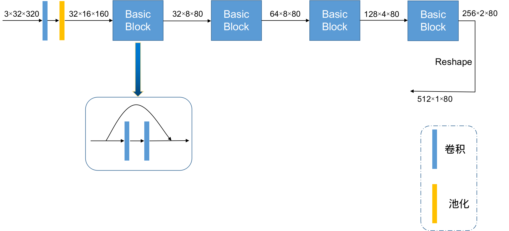
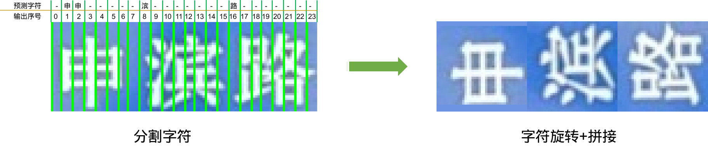

## 简介

百度轻量级文字识别技术创新大赛B榜第8名解决方案

1. 模型采用的是修改后的ResNet, 推理模型总大小**9.7M**, 位于inference文件夹
2. A榜准确率**78.05%**, B榜准确率**77.08%**, batch_size=128时在2080TI上能达**1000+**FPS
3. 提出了一种半监督式的数据增强方法, 可以实现任意方向的文字识别
4. 采用了CTC Loss和Focal Loss的结合

ai studio项目地址: https://aistudio.baidu.com/aistudio/projectdetail/1974552

## 目录

- [算法模型](#算法介绍)
- [数据清洗](#数据清洗)
- [数据增强](#数据增强)
- [算法流程](#算法流程)
- [调参优化](#调参优化)
- [如何运行](#如何运行)

## 算法模型

本方案采用的是**CRNN+CTC**结构，其中CRNN中CNN部分采用修改后的ResNet架构，称之为**TinyResNet**，结构如下图：



- 激活函数使用swish来替换relu

- 此外我们发现, 图片宽度降采样到2, 然后reshape, 比直接降采样到1效果要更好

- RNN部分采用2层双向LSTM，hidden_size设置为78

- 模型代码链接: https://github.com/hao6699/Ultra_light_OCR_No.17/blob/e3443cd5f4025655c11c6885f4b1289532103949/ppocr/modeling/backbones/rec_tinyresnet.py#L101

## 数据清洗

- 统计训练集的字符个数(包含空格), 总计3974个, 写入字典文件`./训练和测试文件/alphabet.txt`中. 观察训练集, 既有简体字也有繁体字, 而且有简繁混标的情形(比如图像中为繁体字, 实际标为简体). 此外, 训练集中的图像有各种方向, 但并无方向标签, 为识别增加了难度.

- 训练前期把10W张图都作为训练集, 无验证集

- 训练中期把10W张图都作为训练集, 拿出2000张A榜数据集中的图像作为验证集(A榜数据集中图像不参与训练)

- 训练后期将所有的繁体字转成了简体字, 形成新的字典文件`./训练和测试文件/alphabet_simplified.txt`, 字符个数减至3735个

## 数据增强

- 普通的数据增强我们采用了模糊、偏移、旋转、随机抹除、随机加横竖线等方式

- 提出了一种半监督式的数据增强方式(代码链接: https://github.com/hao6699/Ultra_light_OCR_No.17/blob/e3443cd5f4025655c11c6885f4b1289532103949/ppocr/data/imaug/rec_img_aug.py#L489)

  1. 在训练集上从头训练一个大模型, 使其在训练集上达到85%以上的准确率
  2. 对10W张训练图像进行预测, 保存预测对的结果以及对应CTC解码之前的输出
  3. 由于CTC自动对齐的特性，我们能根据2的输出来大致确定图像中每个字符的位置, 达到字符分割的目的
  4. 分割好字符后, 可以对每个字符旋转同一角度或是不同角度(本方案采用同一角度, 为±90°)，然后拼接起来

  字符旋转增强示例图:

  

## 算法流程

### Step 1

训练一个以ResNet50为骨干网络的模型, 使其在训练集上达到85%以上的准确率. 

修改好`./configs/rec_chinese_common_train_v2.0.yml`中数据集的路径后, 启动命令: 

` python3 tools/train.py -c configs/rec_chinese_common_train_v2.0.yml `

训练完成后

1. 首先对A榜数据集做一遍预测, 后取2000张图进行校对, 后面的训练将以这2000张作为验证集
2. 运行命令: `python3 tools/infer_rec.py -c configs/rec_chinese_common_train_v2.0.yml -o Global.infer_img=".../TrainImages" Global.pretrained_model="./output/rec_chinese_common_v2.0/best_accuracy"`
3. 运行2步中的命令将会对10W张训练图像进行预测, 并在`./output/rec`中生成一个名为ctc_pred.dump的文件
4. 运行命令: `python3 ./训练和测试文件/deal_ctc_pred.py`, 生成用于数据增强的文件`./训练和测试文件/LabelTrain_ctcpred.txt`

### Step 2

以训练数据全量10W张图像作为训练集(`LabelTrain.txt`), A榜校正后的2000张图作为验证集`(test_label.txt`), 修改好`./configs/rec_chinese_tinyresnet_train_v2.0.yml`中数据集路径后, 启动命令:

` python3 tools/train.py -c configs/rec_chinese_tinyresnet_train_v2.0.yml `

训练完成后, 验证集准确率达到**67.26%**, 线上A榜数据集评测准确率为**76.23%**

### Step 3

此时观察到有些识别失败的案例是由于各种文字方向的问题, 于是加入字符旋转增强, 此时训练集文件变更为`LabelTrain_ctcpred.txt`

将`./configs/rec_chinese_tinyresnet_train_v2.0.yml`中Train-trainsforms-dataset-name中SimpleDataSet修改为ComplexDataSet, transforms中RecAug修改为RecAugRotateWord, 从头开始训练, 启动命令:

` python3 tools/train.py -c configs/rec_chinese_tinyresnet_train_v2.0.yml `

训练完成后, 验证集准确率达到**68.04%**, 线上A榜数据集评测准确率为**76.9%**

### Step 4

发现将繁体转成简体后，线上准确率不变，说明线上评估时会自动将繁体转成简体. 于是运行命令:

`python3 ./训练和测试文件/convert_simplified.py`

将字典文件变更为`alphabet_simplified.txt`, 训练集文件变更为`LabelTrain_ctcpred_simplified.txt`, 验证集文件变更为`test_label_simplified.txt`, 并设置预训练模型路径后, 启动命令:

` python3 tools/train.py -c configs/rec_chinese_tinyresnet_train_v2.0.yml `

训练完成后, 验证集准确率达到**71.43%**, 线上A榜数据集评测准确率为**77.83%**

### Step 5

使用Focal Loss微调

将`./configs/rec_chinese_tinyresnet_train_v2.0.yml`中Loss-name中CTCLoss修改为FocalCTCLoss, 并设置预训练模型路径后, 启动命令:

` python3 tools/train.py -c configs/rec_chinese_tinyresnet_train_v2.0.yml `

训练完成后, 验证集准确率达到**71.98%**, 线上A榜数据集评测准确率为**78.05%**

## 调参优化

Step 1、Step 2和Step 3采用Adam优化器, 初始学习率为0.001, 学习率衰减策略为Cosine, epoch_num为500

Step 4和Step 5采用Adam优化器, 初始学习率为0.0001, 学习率衰减策略为Cosine, epoch_num为500

## 如何运行

`git clone https://github.com/hao6699/Ultra_light_OCR_No.17.git`

### 训练

因时间关系, 前期很多是探索, 包含了许多次模型的微调过程, 但后续根据发现的策略来看, 这里建议直接使用我们提供的简体字典`alphabet_simplified.txt`、简体训练集`LabelTrain_ctcpred_simplified.txt`和简体验证集`test_label_simplified.txt`从头开始训练模型, 先使用CTCLoss训练, 而后使用FocalCTCLoss微调

`rec_chinese_tinyresnet_train_v2.0.yml`示例:

```
Global:
  ... ...
  character_dict_path: ./训练和测试文件/alphabet_simplified.txt
  character_type: ch
  max_text_length: 25
  infer_mode: False
  use_space_char: False
Optimizer:
  name: Adam
  lr:
    name: Cosine
    learning_rate: 0.001
... ...
Loss:
  name: CTCLoss
... ...
Train:
  dataset:
    name: ComplexDataSet
    data_dir: {YourPath}/TrainImages
    label_file_list: ["./训练和测试文件/LabelTrain_ctcpred_simplified.txt"]
    transforms:
      - DecodeImage: # load image
          img_mode: BGR
          channel_first: False
      - RecAugRotateWord:
... ...

Eval:
  dataset:
    name: SimpleDataSet
    data_dir: {YourPath}/TestAImages
    label_file_list: ["./训练和测试文件/test_label_simplified.txt"]
... ...
```

训练启动命令:

` python3 tools/train.py -c configs/rec_chinese_tinyresnet_train_v2.0.yml `

### 模型导出

此项目已包含了导出前的模型(`./output/rec_chinese_tinyresnet_v2.0`)和导出后的模型(`./inference`), 若要导出模型, 运行命令:  

```
python3 tools/export_model.py -c configs/rec_chinese_tinyresnet_train_v2.0.yml -o Global.pretrained_model=./output/rec_chinese_tinyresnet_v2.0/best  Global.save_inference_dir=./inference/rec_inference/
```

### 预测

1. 导出前的模型预测请运行命令:

   `python3 tools/infer_rec.py -c configs/rec/rec_chinese_tinyresnet_train_v2.0.yml -o Global.infer_img="{YourPath}/TestAImages" Global.pretrained_model="./output/rec_chinese_tinyresnet_v2.0/best"`

2. 导出后的模型预测请运行命令:

   ```
   python3 tools/infer/predict_rec.py  --rec_model_dir=./inference/  --image_dir={YourPath}/TestAImages
   ```

